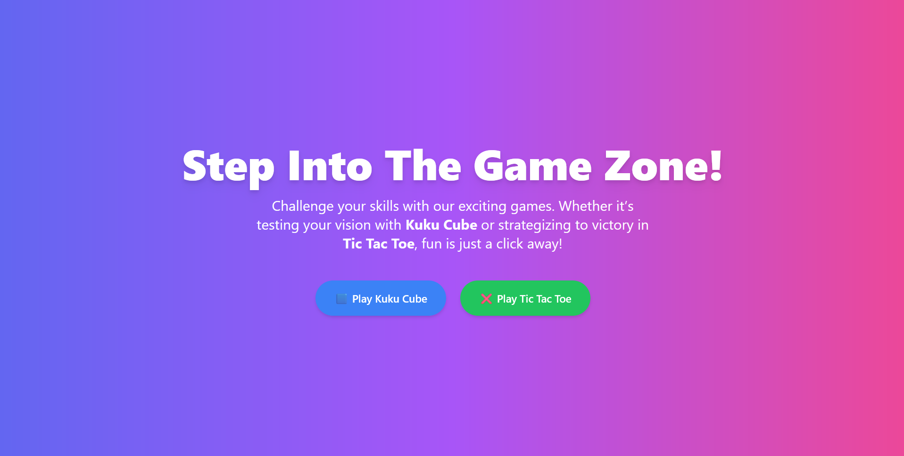
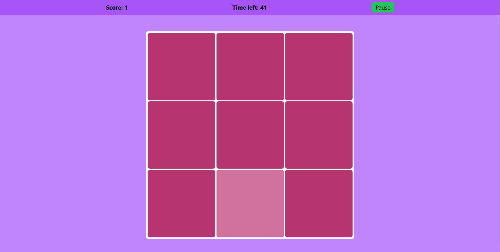
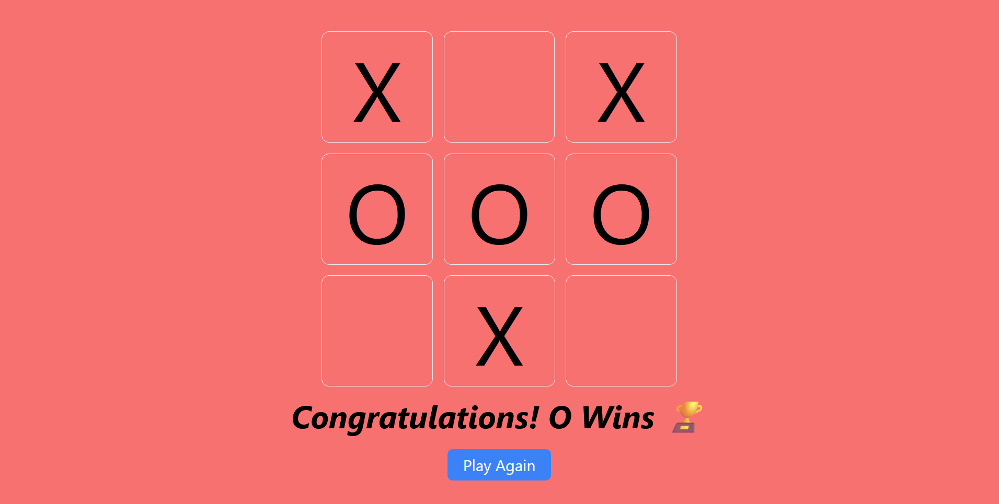

# Game Zone

Welcome to the **Game Zone**! This repository contains two exciting games:

- **Kuku Cube**: Test your color vision and reflexes by identifying the unique color tile.
- **Tic Tac Toe**: A classic strategy game to challenge your logic and decision-making skills.

## Features

### Kuku Cube
- Dynamic grid size that increases as you score points.
- Timer-based gameplay for an added challenge.
- Interactive animations powered by **GSAP**.
- Sound effects for correct and incorrect actions.

### Tic Tac Toe
- Simple and intuitive interface.
- GSAP animations for cell clicks and winner announcements.
- Tracks and announces the winner or a draw.

---

## Installation

### Prerequisites
Ensure you have the following installed on your system:

- [Node.js](https://nodejs.org/)
- [npm](https://www.npmjs.com/) or [yarn](https://yarnpkg.com/)

### Steps

1. Clone this repository:
   ```bash
   git clone "https://github.com/harshal255/game-zone"
   ```
2. Navigate to the project directory:
   ```bash
   cd game-zone
   ```
3. Install dependencies:
   ```bash
   npm install
   ```
   or
   ```bash
   yarn install
   ```
4. Start the development server:
   ```bash
   npm start
   ```
   or
   ```bash
   yarn start
   ```

---

## File Structure

```
src/
├── components/
│   └── modal.tsx            # Modal component for alerts
├── pages/
│   ├── home.tsx             # Home page
│   ├── kukuCube.tsx         # Kuku Cube game
│   └── ticTacToe.tsx        # Tic Tac Toe game
├── static/
│   ├── JeremyBlakePowerup.m4a # Background music for Kuku Cube
│   └── error-4-199275.mp3     # Error sound for Kuku Cube
├── App.tsx                  # Main application file
└── index.tsx                # Entry point
```

---

## Usage

### Home Page
- Navigate to the home page to select a game.
- Click on **Play Kuku Cube** or **Play Tic Tac Toe** to start.

### Kuku Cube
- Identify the odd-colored tile and click on it.
- Avoid clicking the wrong tiles.
- Your score increases as the grid size grows.

### Tic Tac Toe
- Take turns as `X` and `O`.
- Aim to align three of your marks in a row, column, or diagonal.
- Click **Play Again** to reset and start a new game.

---

## Technologies Used

- **React.js**: Framework for building UI components.
- **GSAP**: Animation library for smooth transitions and effects.
- **React Router**: Navigation and routing between pages.
- **TypeScript**: For type safety and code clarity.

---

## Screenshots


### Home Page


### Kuku Cube


### Tic Tac Toe


---

## License

This project is licensed under the [MIT License](LICENSE).

---

## Contributions

"Feel free to share another contributor's games and encourage them to add their own game by opening an issue or submitting a pull request."

Let me know if you'd like further modifications!
